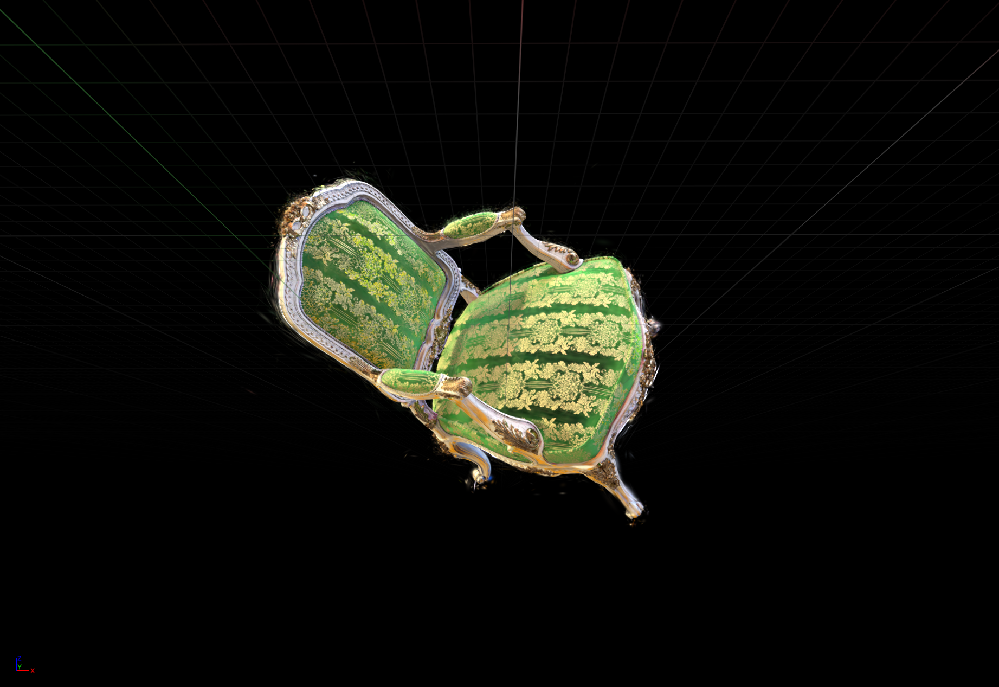

# UnrealGaussianSplatting



UnrealGaussianSplatting is a plugin for importing, loading, and rendering standard 3D Gaussian Splatting data in Unreal Engine.

This plugin is currently developed against **Unreal Engine 5.5.4**.

## Features

### Editor

- Import standard 3DGS `.ply` files as `Gaussian Splat Asset`
- Support both `ascii` and `binary_little_endian` PLY formats
- Custom Details panel for Gaussian assets and components
- Standalone editor window:
  - `Window -> Gaussian Splat Editor`

### Runtime

- Load external `.ply` files at runtime
- Create transient `UGaussianSplatAsset` instances from disk files
- Assign assets to `UGaussianSplatComponent` in Blueprint or C++
- Use `AGaussianSplatActor` as a ready-to-place scene actor

### Rendering

- `Points` mode for debugging and validation
- `Gaussian Billboards` mode as the main rendering path
- Support for SH color, opacity, density scaling, and basic runtime controls

## Project Layout

- `Source/GaussianSplattingRuntime`
  Runtime module containing assets, components, runtime loading, and rendering code.
- `Source/GaussianSplattingEditor`
  Editor module containing the asset factory, Details customizations, and the standalone editor panel.
- `Shaders`
  Shader implementations for points and Gaussian billboards.
- `Docs`
  Project notes and planning documents.

## Installation

Place the plugin inside your project's `Plugins` directory:

```text
<YourProject>/Plugins/UnrealGaussianSplatting
```

Then regenerate project files and compile, or rebuild the plugin from Unreal Editor.

## Editor Workflow

### 1. Import a Gaussian Asset

Import a standard 3DGS `.ply` file from the Content Browser. The plugin will create a `Gaussian Splat Asset`.

The current parser reads common 3DGS fields including:

- `x/y/z`
- `f_dc_0..2`
- `f_rest_*`
- `opacity`
- `scale_0..2`
- `rot_0..3`

During import, the plugin performs:

- COLMAP-to-UE coordinate conversion
- color and opacity decoding
- SH coefficient reordering
- bounds generation
- GPU resource initialization

### 2. Display in a Level

The simplest workflow is:

1. Place an `AGaussianSplatActor` in the level
2. Assign a `Gaussian Splat Asset` to its `SplatComponent`

Main component parameters:

- `DensityScale`
- `OpacityScale`
- `PointSize`
- `MaxRenderPoints`
- `PreviewRenderMode`

### 3. Standalone Editor Panel

Open:

```text
Window -> Gaussian Splat Editor
```

The panel works with the currently selected:

- `AGaussianSplatActor`
- `UGaussianSplatComponent`
- `UGaussianSplatAsset`

Current actions:

- `Refresh Asset`
- `Rebuild Bounds`
- `Focus View On Actor`
- `Move Actor To Origin`
- `Move Actor To View`
- `Points`
- `Billboards`

This panel is currently a lightweight working panel, not a full interactive Gaussian editing mode.

## Runtime Workflow

The plugin currently exposes two basic Blueprint helpers:

- `LoadGaussianAssetFromFile`
- `SetGaussianAsset`

Typical runtime flow:

1. Call `LoadGaussianAssetFromFile(FilePath, OutError)`
2. Receive a transient `UGaussianSplatAsset`
3. Call `SetGaussianAsset(Component, Asset)`

Notes:

- The file path must be a normal disk path, not a Content Browser asset path
- Runtime-loaded assets are transient and are not automatically saved as `.uasset`

## Units and Scale

`AGaussianSplatActor` currently defaults to **100x scale** when created.

This is a practical compensation for the common size mismatch between Gaussian / COLMAP style data and Unreal's centimeter-based world scale.

If you are using older placed instances, or if your source data already matches Unreal scale, you may still need to adjust actor scale manually.

## Current Limitations

- Interactive editing tools are not connected yet
  - no cutout / box selection / partial splat deletion
  - no dedicated Gaussian `EdMode`
  - no full `InteractiveTool` workflow yet
- The current main rendering path is still a billboard-based 3DGS integration
- Rendering quality is still behind a full original 3DGS rasterizer
- More complete antialiasing / footprint / coverage alignment is still missing
- Runtime experience is still basic
  - no full loader actor workflow
  - no streaming / LOD solution yet
